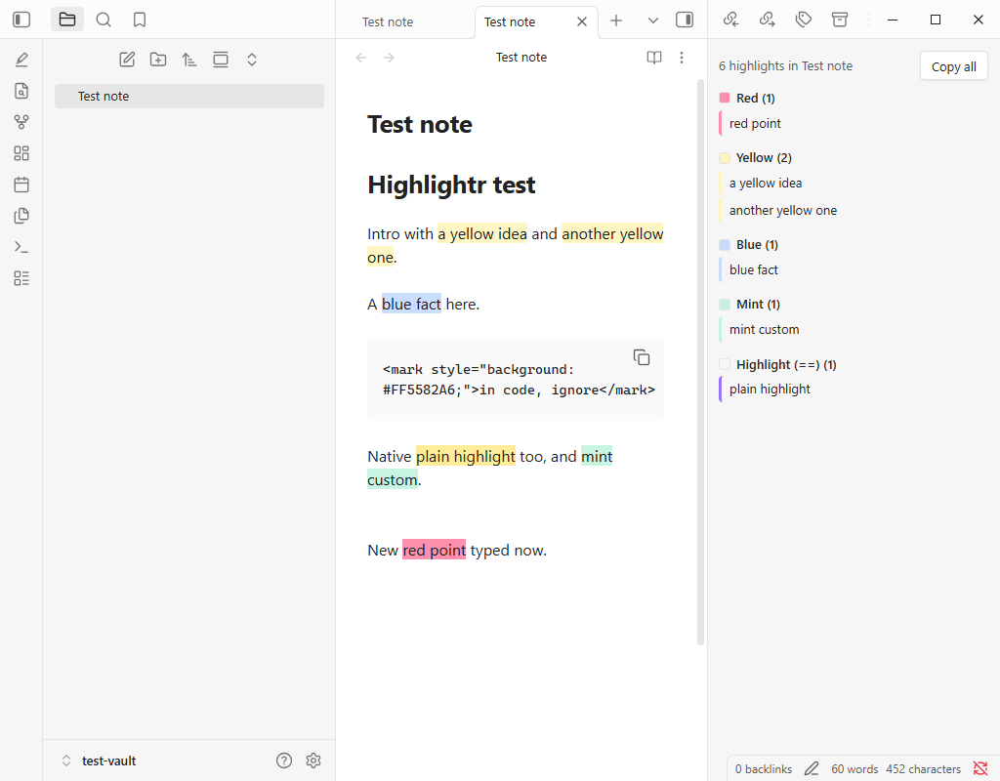

# Tinted Highlights

Colour-coded highlighting for Obsidian that stays readable on any theme, with a panel that shows every highlight in a note.

Tinted Highlights is built on [Highlightr](https://github.com/chetachiezikeuzor/Highlightr-Plugin) by Chetachi Ezikeuzor, under the Mozilla Public License 2.0. It is a separate plugin and is not made or endorsed by the author of Highlightr.

## What it does

- **Highlight in your colours.** Select text, then right-click and choose **Highlight**, or open the highlight menu, and pick a colour. Every colour is also its own command, so you can give each one a hotkey.
- **Readable text on any theme.** Each highlight colour gets dark or light text, chosen for how the colour actually looks on your theme, and it updates when you switch between light and dark. You can turn this off in settings.
- **Highlights panel.** Every highlight in the open note, grouped by colour. Click one to jump to it. **Copy all** gives you a Markdown list to paste into another note. It also lists Obsidian's own `==highlights==`, skips code blocks, and updates as you type.
- **Recolour a highlight.** Select highlighted text and pick another colour to change it. Pick the same colour to remove it.
- **Edit a colour.** Change a colour's name or value in place. It keeps its place in your list.
- **Your colours, your way.** Add colours with Obsidian's colour picker or a hex code, drag to reorder, and choose a style (plain, lowlight, floating, rounded, realistic). Keep colours in the note (best for exporting) or as CSS classes (easy to restyle).
- **Works on current Obsidian,** including settings opened in their own window.

## Coming from Highlightr

If you used Highlightr, the first time Tinted Highlights runs it brings over your colours, their order and your choices. Turn Highlightr off so the two do not both add menu items. Your notes do not change: highlights are the same `<mark>` HTML, so everything you highlighted before keeps its colour. Hotkeys belong to each plugin, so set your highlight hotkeys again.

## Known limit

On iPhones and iPads older than iOS 16.4, the colour rules the plugin adds cannot load. Highlights still show their colours, but the automatic readable text does not apply there.

## Credit

Highlightr was created by [Chetachi Ezikeuzor](https://github.com/chetachiezikeuzor), and Tinted Highlights is built on their code and design. Ideas for the readable text and recolouring came from community pull requests to Highlightr by SyncroIT, sozokin and romyi.

## Licence

Mozilla Public License 2.0, the same licence as Highlightr. See [LICENSE](LICENSE).

## Problems and ideas

[Open an issue](https://github.com/lagudafuadtosin/tinted-highlights/issues).
